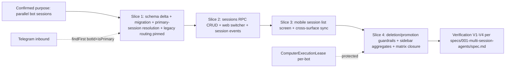

# Change Story — 001-multi-session-agents

## Confirmed purpose

Let a user run parallel, separately-contexted sessions (threads) with the same bot — each with its own history, compaction, run serialization, and resumability on every surface — without breaking Telegram routing or existing deployments (current threads become each bot's primary session).

Purpose: confirmed by maintainer via purpose gate (.super-speckit/purpose/001-multi-session-agents/decision.json).
Route: **milestone** — split into demoable vertical slices, reassessed after each verified slice.

## Diagram-first path

## What will change

- **Schema** (`packages/db/prisma/schema.prisma` + migration): drop `Thread.botId @unique` (:473) → `@@index([botId])`; add `title String?`, `isPrimary Boolean @default(false)`, `lastMessageAt DateTime?`; Postgres partial unique index `(botId) WHERE is_primary` via raw SQL; backfill existing threads as primary. Prisma back-relation flips `Bot.thread` → `threads Thread[]` (breaking, inventoried).
- **Resolution**: `resolveThreadTarget` (apps/api/src/thread-target.ts:268-303) gains optional `threadId`; botId-only → primary session. All 12 `threads/*` RPCs inherit session addressing.
- **New RPC**: `sessions/list|create|rename|delete` (owner-scoped) in router.ts near :1550, contracts in @rakazo/contracts.
- **Legacy pinning**: 7 nondeterministic `findFirst({ botId })` sites (messaging-inbound.ts:124,690,740; messaging.ts:60,132,157-158; messaging-delivery.ts:284) + ~6 `bot.thread` navigations + 8 test/CLI `findUnique({botId})` sites → primary-session lookups.
- **Ordering**: `lastMessageAt` bumped in `createThreadMessageInTransaction`; list order + cursor defined.
- **Surfaces**: web session switcher in bot chat view; mobile per-bot session list screen (Expo Router) between inbox and thread.tsx.
- **Realtime**: `session.created/renamed/deleted` events; sidebar unread = OR over sessions; preview/run-status = primary session.

## What stays protected

- Per-bot `ComputerExecutionLease` (computer-lifecycle.ts:439-505) — never torn down by a session delete; delete-with-active-run refused.
- Group/external uniques at schema.prisma:475/:477.
- `bots/duplicate` clones primary session only; bot-level memory shared across sessions (accepted v1, reversal path recorded).
- Telegram inbound always lands on a live primary session (auto-promotion when primary deleted with siblings; last-session delete refused).

## Evidence and unknowns

| Claim | Classification | Evidence / next probe |
| --- | --- | --- |
| Full grill: 16 resolutions, 0 purpose conflicts | proven | .super-speckit/grills/001-multi-session-agents/spec-grill.md |
| Unread/compaction/seq state already per-Thread | proven | schema.prisma:469-495; messages.ts:60-70 |
| Choke point resolveThreadTarget serves all threads/* RPCs | proven | thread-target.ts:268-303; router.ts:1550-1792 |
| Legacy `findFirst({botId})` sites misroute after relaxation if unpinned | proven | messaging-inbound.ts:124,690,740; messaging.ts:60,132,157-158; messaging-delivery.ts:284 |
| threadTarget contract file in packages/contracts | inferred (verify at implementation) | Maker checks exact path before editing |
| Slice-level estimates | unknown until S1 verified | reassess after each verified slice (route=milestone) |
