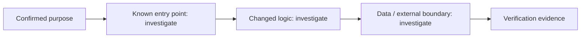

# Change Story — 002-inspiration-hub

## Confirmed purpose
A welcoming, activity-aware home surface: hub route inside the existing shell showing guided first actions for empty deployments, recent threads for active ones, and a bundled inspiration gallery whose cases create preconfigured bots in one click. Mobile recorded as degradation in v1.

## Route
normal

## Diagram-first path

## What will change

- Not yet verified. Link affected entry points, components, contracts, and data paths after repository investigation.

## What stays protected

- Preserve the Purpose Map non-goals and existing contracts until evidence supports a change.

## Evidence and unknowns

| Claim | Classification | Evidence / next probe |
| --- | --- | --- |
| Change path | unknown | inspect codebase and Atlas cards |
