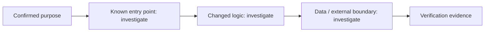

# Change Story — 003-agent-marketplace

## Confirmed purpose
Agents become portable and discoverable: versioned JSON bundles (persona, tools, skills, MCP definitions, avatar — never secrets) export/import through a mandatory server-side pre-install review; a browsable marketplace over one neutral catalog seam (bundled default, operator URL, hosted registry, labeled 3rd-party pulls) installs agents/skills/MCP through the existing machinery with nothing auto-granted.

## Route
milestone

## Diagram-first path

## What will change

- Not yet verified. Link affected entry points, components, contracts, and data paths after repository investigation.

## What stays protected

- Preserve the Purpose Map non-goals and existing contracts until evidence supports a change.

## Evidence and unknowns

| Claim | Classification | Evidence / next probe |
| --- | --- | --- |
| Change path | unknown | inspect codebase and Atlas cards |
