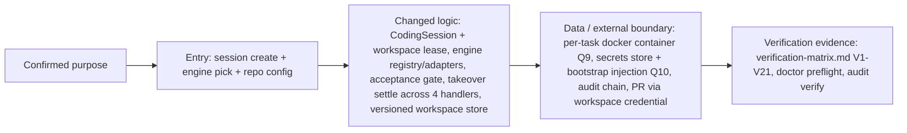

# Change Story — 004-code-mode

## Confirmed purpose
Rakazo Code: agent-assisted development workspace. Purpose confirmed 2026-10-01 (user: Poom5741). First journey: repo-to-PR on Linux-compatible JS/TS web repos with normal Pi + OMP engines fixed per session. Grill r1 resolved takeover-gap scope, versioned store scope, engine-continuation rule, secrets-boundary flag; Q9 (isolation: docker on the existing box) + Q10 (secrets: scoped audited injection, Option B) decided 2026-10-01 — `.super-speckit/design/004-code-mode/decision.json`.

## Route
milestone

## Diagram-first path

## What will change

- **New durable entity**: CodingSession bound to (workspace, engine) at creation + workspace
  lease so two runs never own one workspace (packages/db/prisma/schema.prisma + additive
  migration — protected path, independently reviewed).
- **Engine dispatch**: registry + normal-pi adapter reusing existing run machinery
  (executor.ts:1102-1163, :4721-4739); OMP adapter added behind the same interface after the
  Q1/G10 RPC experiment.
- **Takeover safety**: heldForTakeover guard extended to shell (executor.ts:2568), write_file
  (:2424-2436), schedule_create (:2761), add_mcp_server (:2865) with settle semantics.
- **Workspace persistence**: latest-only commit/.previous deletion (home.ts:57-82) replaced by
  a versioned revision archive with dirty-set query and selected-revision restore (:86-93).
- **Isolation runtime**: per-task container lifecycle on the existing docker sandbox seam,
  doctor preflight, collision policy (Q9; one host-side action prerequisite).
- **Secrets path**: project-scoped encrypted store, declared-name grants, bootstrap-only
  injection, single deny-list egress filter replacing literal-only redaction
  (executor.ts:2601) for coding sessions, hash-chained audit (Q10; docs/bot-secrets.md
  annotated as carved out for this feature only).
- **New surfaces later**: CLI package (none exists in apps/), mobile enumerated workflows,
  reconnectable terminals via adapter-kit pty extension (interfaces.ts:102-106).

## What stays protected

- Purpose-map non-goals (no ZCode parity, no debugger UI, no universal undo).
- Existing run/session contracts for non-coding sessions — coding sessions are additive.
- migrations/** changes are additive and lossless (V14); computer lease semantics per-bot
  unchanged for non-coding flows.
- docs/bot-secrets.md refusal everywhere except the 004 task-container carve-out.

## Evidence and unknowns

| Claim | Classification | Evidence / next probe |
| --- | --- | --- |
| Q9/Q10 decisions recorded | proven | .super-speckit/design/004-code-mode/decision.json |
| Isolation needs one host-side action | proven | design-brief.md D-Q9 (seccomp EPERM evidence, 2026-10-01) |
| OMP RPC transport + builtin approvals | unknown | Q1/G10 experiment (S4 T24) before adapter work |
| Session/lease schema shape | inferred | S1 T1 investigation + migration review |
| Setup format (Q7), budgets (Q6) | unknown | S5 tasks propose reversible defaults for user sign-off |
