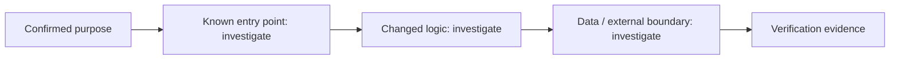

# Change Story — 004-code-mode

## Confirmed purpose
Rakazo Code: agent-assisted development workspace. Purpose confirmed 2026-10-01 (user: Poom5741). First journey: repo-to-PR on Linux-compatible JS/TS web repos with normal Pi + OMP engines fixed per session. Grill r1 resolved takeover-gap scope, versioned store scope, engine-continuation rule, secrets-boundary flag; open decisions Q9 (isolation env) + Q10 (secrets boundary) gate the plan.

## Route
milestone

## Diagram-first path

## What will change

- Not yet verified. Link affected entry points, components, contracts, and data paths after repository investigation.

## What stays protected

- Preserve the Purpose Map non-goals and existing contracts until evidence supports a change.

## Evidence and unknowns

| Claim | Classification | Evidence / next probe |
| --- | --- | --- |
| Change path | unknown | inspect codebase and Atlas cards |
