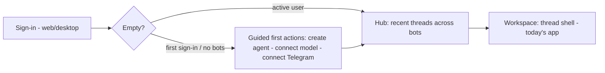
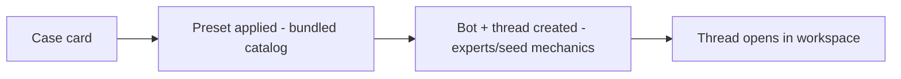

# Purpose Map — 002 Inspiration hub (visual)

Status: DRAFT · human gate pending. Visual version: `purpose-map.html` (same content, rendered).

## Entry flow

## Hub layout — one surface, three zones

| Zone | Content |
| --- | --- |
| Header | greeting + surface chips (web/desktop; mobile = native equivalent or recorded degradation) |
| Activity | recent threads across bots, per-bot unread |
| **Get inspired** (primary zone) | curated case cards, bundled versioned preset |
| First actions | create agent · connect model · connect Telegram (empty state only) |

Gallery card anatomy: `visual → title → [Make similar]`.

## "Make similar" path

## Surfaces

| Surface | Hub | Make similar |
| --- | --- | --- |
| Web | full | ✓ |
| Desktop | full (hosts web) | ✓ |
| Mobile | native equivalent or recorded degradation | follows hub decision |

## Constitution

Monochrome + bot identity color only · semantic tokens via ui-tokens · progressive disclosure · every visible word justified in PR.

## Non-goals

~~points/credits/leaderboard~~ · ~~hardcoded marketing banners~~ · ~~new hosted service~~ · ~~mobile parity promise~~

## The gate (four fields)

| Field | Content |
| --- | --- |
| Outcome | Open on a welcoming, activity-aware home; gallery cases become working bots in one click. |
| People | New deployment owners (guided start) · active users (activity glance) · maintainer curates catalog. |
| Success | Empty → guided actions; active → real recent threads; case → preconfigured bot/thread; constitution holds; mobile equivalent or recorded degradation. |
| Non-goals | Points/credits · hardcoded banners · new hosted service · mobile parity promise. |

## Human purpose gate

This map is a draft. A human confirms that this is the intended purpose, or corrects it. Technical implementation choices are deliberately outside this gate.
