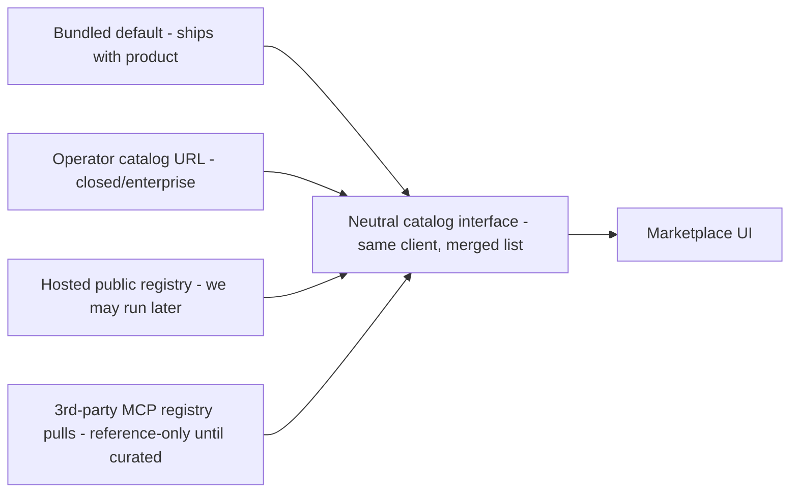
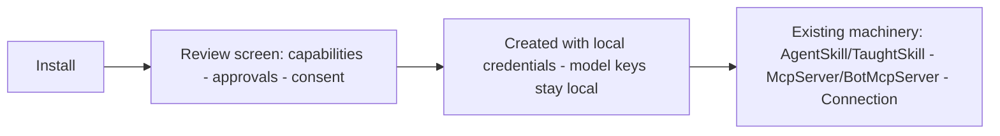

# Purpose Map — 003 Agent import/export + marketplaces (visual)

Status: DRAFT → human-confirmed. Visual version: `purpose-map.html` (same content, rendered).

## The three lanes

| Lane | Steps |
| --- | --- |
| ⬆ Export | Pick agent → bundle: persona · sections · tools · skills · MCP defs · avatar → ✗ secrets/memory/credentials never leave → versioned JSON + asset files (portable, human-inspectable) |
| ⬇ Import | Bundle in → **pre-install review screen** (what will be created · capabilities granted · required connections) → adjust to local model credentials → install → agent appears in space |
| 🛒 Marketplace | Browse agents · skills · MCP servers → search + categories + detail views (capabilities + required connections) → one-click install (same import review) |

## Catalog seam — one client, swappable sources (Q1/Q3 resolved)

## Install = same rules as a locally built agent

Nothing auto-grants host access · no parallel skill/MCP system · security review (constitution §7) gates the import path.

## Non-goals

~~payments/ratings/accounts~~ · ~~install-count telemetry~~ · ~~hosted service required for v1~~ · ~~secrets/memory/user data in bundles~~ · ~~auto-granted capabilities~~

## Open at gate time

| Item | State | Path |
| --- | --- | --- |
| Q2 — skill bundle format | open → research task (do AgentSkill/TaughtSkill serialize cleanly, or is a canonical format needed first?) | grill Investigator role |
| Scope risk | spec marks this highest-risk of the three — expect milestone route with sliced delivery | route decision after grill |

## The gate (four fields)

| Field | Content |
| --- | --- |
| Outcome | Agents move between deployments via inspectable bundles; users discover and install agents/skills/MCP from a browsable marketplace with one-click install. |
| People | Users moving agents across accounts/deployments · operators curating closed catalogs · maintainers curating the bundled preset · anyone browsing the open marketplace later. |
| Success | Export→import round-trip preserves behavior (no secrets); malicious bundles rejected; marketplace browse→install→agent-runs works; install passes the same security constitution as local agents. |
| Non-goals | Payments/ratings/accounts · telemetry · hosted-service requirement for v1 · secrets/memory/credentials in bundles · auto-granted capabilities. |

## Human purpose gate

Confirmed by the maintainer on the diagram-first visual map (see decision.json).
